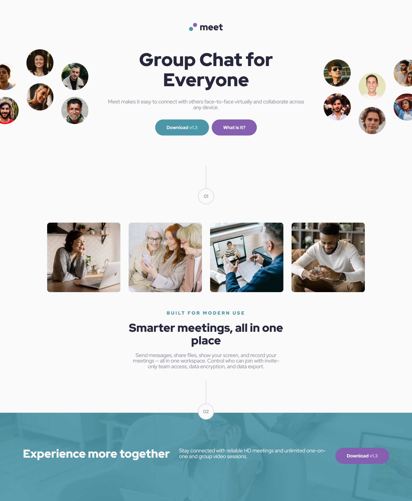

# 🚀 Meet Landing Page - Frontend Mentor Challenge

This is a solution to the [Meet Landing Page Challenge on Frontend Mentor](https://www.frontendmentor.io/challenges/meet-landing-page-rbTDS6OUR). The goal was to create a responsive landing page showcasing a group video chat platform with clear visual hierarchy, interactivity, and polished layout.

## 📸 Preview

## 🔗 Links

- [Live Site](https://chryspenalber.github.io/meet-landing-page/)  
- [Repository](https://github.com/chryspenalber/meet-landing-page)

## 📐 Overview

This landing page includes:

- Introduction section with floating images and action buttons.
- Features section with grid-aligned image previews and descriptions.
- Custom page separators and stylized footer with background image.

Fully responsive and styled with **SCSS**, the layout adapts elegantly from desktop to mobile screens.

---

## 🛠️ Built With

- **HTML5** — Semantic structure
- **SCSS** — Modular and responsive styling
- **CSS Grid** and **Flexbox** — For layout and alignment
- **Google Fonts** — Red Hat Display
- **Media Queries** — For responsiveness

---

## 📲 Responsive Design

The layout is fully responsive and adapts from large desktops to small mobile screens using:

- CSS Grid for structured elements
- Flexbox for alignment and spacing
- `clamp()` for fluid typography and element sizing
- Media queries for layout adjustments at breakpoints (e.g. 768px, 480px)

---

## 💡 What I Learned

Through this project, I practiced:

- Advanced use of **CSS Grid** and **Flexbox** together
- Structuring a page using semantic HTML and modular SCSS
- Creating **layered backgrounds** with `::before` and `::after` in the footer

---

## 🧠 Continued Development

Some future ideas or improvements:

- Add animations on scroll using JavaScript or CSS
- Convert the project into a React component-based version
- Add a dark mode toggle 🌙

---

## 📚 Useful Resources

- [CSS Tricks - clamp()](https://css-tricks.com/using-clamp-for-viewport-based-sizing/)
- [Sass documentation](https://sass-lang.com/documentation/)
- [Google Fonts - Red Hat Display](https://fonts.google.com/specimen/Red+Hat+Display)

---

## 👩‍💻 Author

- GitHub - [@yourusername](https://github.com/chryspenalber)
- Frontend Mentor - [@yourusername](https://www.frontendmentor.io/profile/chryspenalber)
- LinkedIn - [Your Name](https://www.linkedin.com/in/chrystiana-penalber/)